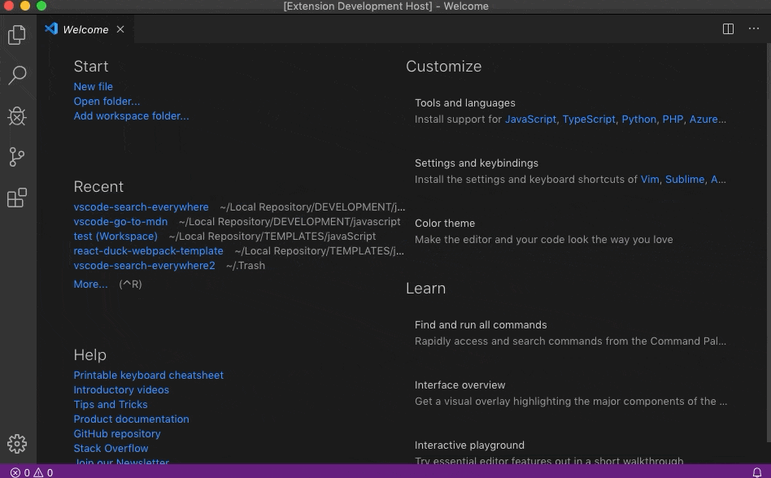
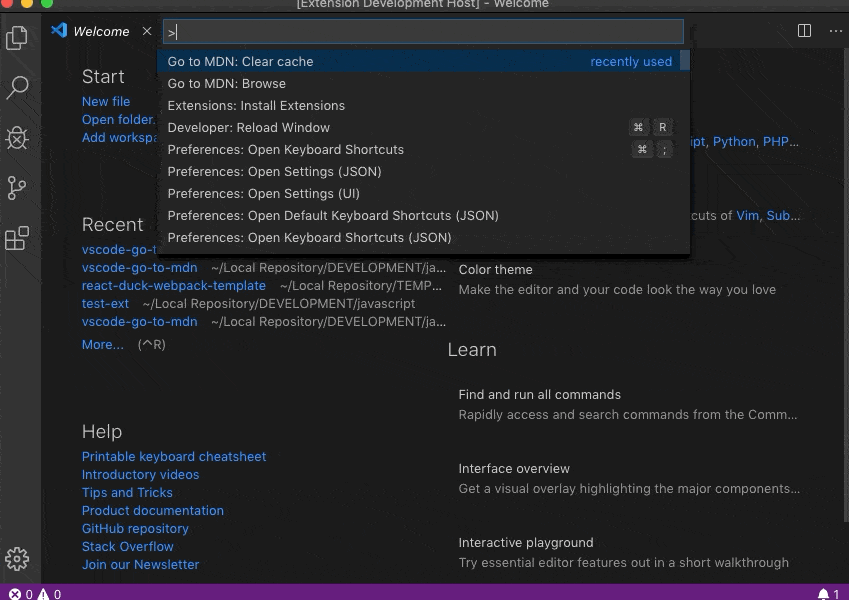
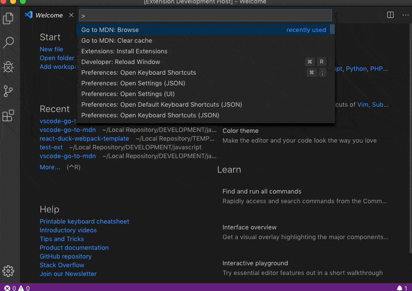

# Go to MDN

The extension is a complement for feature added in version 1.38 (August 2019 release) - [MDN Reference for HTML and CSS](https://code.visualstudio.com/updates/v1_38#_mdn-reference-for-html-and-css).
It allows user to browse MDN web docs directly from Visual Studio Code using command palette.

The data comes from [MDN Github repository](https://github.com/mdn/browser-compat-data).
Big thanks for MDN and all contributors for great job.

Due to big amount of data, to avoid delay in downloading everything at once, the requested data are lazy loaded.
It means that they are downloaded once the user asks for them and cached after that.
Second call for the same data will be fed from cache, not from github api.
This approach allows to keep the extension responsive.

## Features

The data provided in extension are limited to the ones with valid url in MDN github repository mentioned at the beginning.
Once confirming the interested item, the default browser will be opened with direct url according your request.

You have two ways to browse the results:

* flat navigation:

* tree navigation:

If you do not find what you are looking for, you could just type the term you are looking, press Enter and you MDN web docs
website will be opened with search results for your query.

## Commands

* `goToMDN.browse`

  Search any text or browse available data downloaded from MDN API.

* `goToMDN.clearCache`

  If you know that the cached data is outdated, clear extension cache to download it one more time.

## Extension Settings

* `goToMDN.githubPersonalAccessToken`

Allows to increase number of requests to API from 60 (unauthenticated) to 5000 (authenticated) per hour.

Github API has limits for requests number. For unauthenticated users it is 60 requests per hour.
For authenticated it equals to 5000 requests per hour.
Most of users should not need more than 60, but in case anyone would like to browse a lot, he/she should
provide a personal access token (in settings) generated in his/her github account to increase the available
requests number.

* `goToMDN.shouldDisplayFlatList`

Flag to determine if the results should be displayed as flat list or as tree with navigation.
Default value is `true`.

## Source Code

The source code is available on GitHub [here](https://github.com/AgilePlayers/vscode-go-to-mdn).

## Release Notes

Please check changelog for release details.

## Author

[Kamil Bysiec](https://github.com/kbysiec)

## Acknowledgment

If you found it useful somehow, I would be grateful if you could leave a "Rating & Review" in Marketplace or/and leave a star in the project's GitHub repository.

Thank you.
